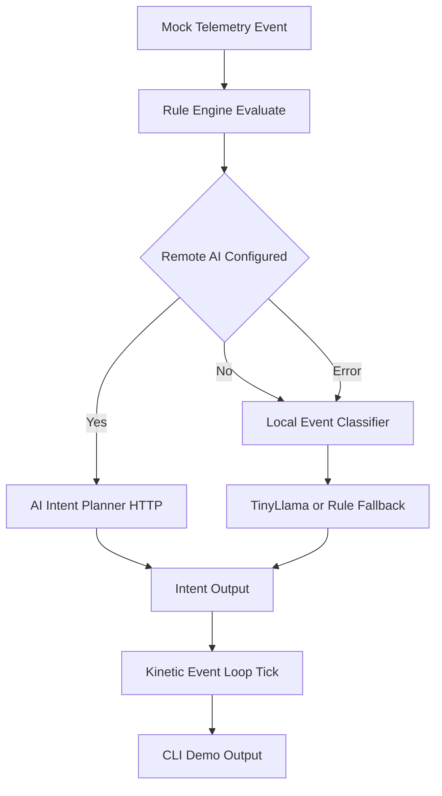

# KineticOps

KineticOps is a lightweight Python scaffold for a fast HackAIthon build focused on closed-loop Kubernetes operations.

## 8-hour sprint scope

- Stand up a modular repo structure for telemetry, interpretation, actions, verification, and CLI UX.
- Keep components as stubs to enable rapid parallel development.
- Validate a single golden-path flow end to end with mocked data.

## Golden-path demo

The intended demo path for this scaffold is:

1. Generate or ingest a mock telemetry event.
2. Interpret the event into an AI-assisted action intent.
3. Build a patch candidate and "commit" via a GitOps stub.
4. Run a verifier stub against Kubernetes state assumptions.
5. Display progress and status through the CLI banner/path.



## Diagram rendering

- Use Markdown Preview (`Ctrl+Shift+V`) for this README and `docs/golden-path.md`.
- Use a Mermaid-specific preview for `docs/golden-path.mmd`.
- If preview fails with `No diagram type detected`, the viewer is parsing full Markdown as Mermaid; switch to Markdown Preview.

## Run the project

```bash
py -3.13 -m venv .venv
# Windows: .venv\\Scripts\\activate
# macOS/Linux: source .venv/bin/activate
pip install -r requirements.txt
python main.py
```

## Demo script

Run a scenario-based demo that prints event + generated intent:

```bash
python scripts/run_demo.py --scenario all
```

Other options: `mock`, `network`, `auth`, `storage`, `service`.

Pitch + live demo talk track: `docs/pitch-demo.md`.

Recommended Python version: 3.13.x

Optional dev dependencies (tests + local tensor/NumPy interop):

```bash
pip install -r requirements-dev.txt
```

Quick verify (PyTorch + tests):

```bash
python -c "import torch; print(torch.__version__)"
python -m pytest -q
```

Windows one-command bootstrap + verify:

```powershell
pwsh -ExecutionPolicy Bypass -File .\scripts\bootstrap_verify.ps1
```

## AI planner (stub)

- The interpreter now includes a minimal AI planner stub in `interpreter/ai_planner.py`.
- If `KINETICOPS_AI_ENDPOINT` is set, `RuleEngine` attempts a model-backed plan via HTTP.
- If unset or unavailable, it falls back to local event classification.
- Local fallback chain: TinyLlama (`interpreter/local_classifier.py`) -> deterministic keyword rules.
- Local classification emits `classification`, `reason`, `source`, and `confidence` (0..1).

Optional environment variables:

- `KINETICOPS_AI_ENDPOINT` (example: `https://models.github.ai/inference/chat/completions`)
- `KINETICOPS_AI_MODEL` (default: `meta/llama-4-maverick-17b-128e-instruct-fp8`)
- `KINETICOPS_AI_TIMEOUT` (default: `8` seconds)
- `KINETICOPS_AI_API_KEY` (falls back to `GITHUB_TOKEN`)
- `KINETICOPS_LOCAL_CLASSIFIER_ENABLED` (`1` default, set `0` to force keyword-rule fallback)
- `KINETICOPS_LOCAL_CLASSIFIER_MODEL` (default: `TinyLlama/TinyLlama-1.1B-Chat-v1.0`)
- `KINETICOPS_LOCAL_CLASSIFIER_MAX_TOKENS` (default: `64`)
- `KINETICOPS_LOCAL_CLASSIFIER_STRICT_JSON` (`1` default; strict parser for model output)

Suggested GitHub Models setup:

```bash
# PowerShell
$env:GITHUB_TOKEN = "<your_github_pat>"
$env:KINETICOPS_AI_API_KEY = $env:GITHUB_TOKEN
$env:KINETICOPS_AI_ENDPOINT = "https://models.github.ai/inference/chat/completions"
$env:KINETICOPS_AI_MODEL = "meta/llama-4-maverick-17b-128e-instruct-fp8"
python main.py
```

## Notes

- This repository intentionally contains placeholders and TODOs only.
- No production business logic is implemented yet; AI integration is scaffold-level only.
